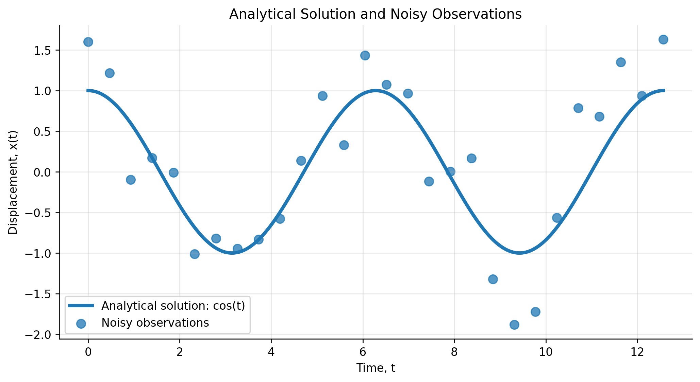
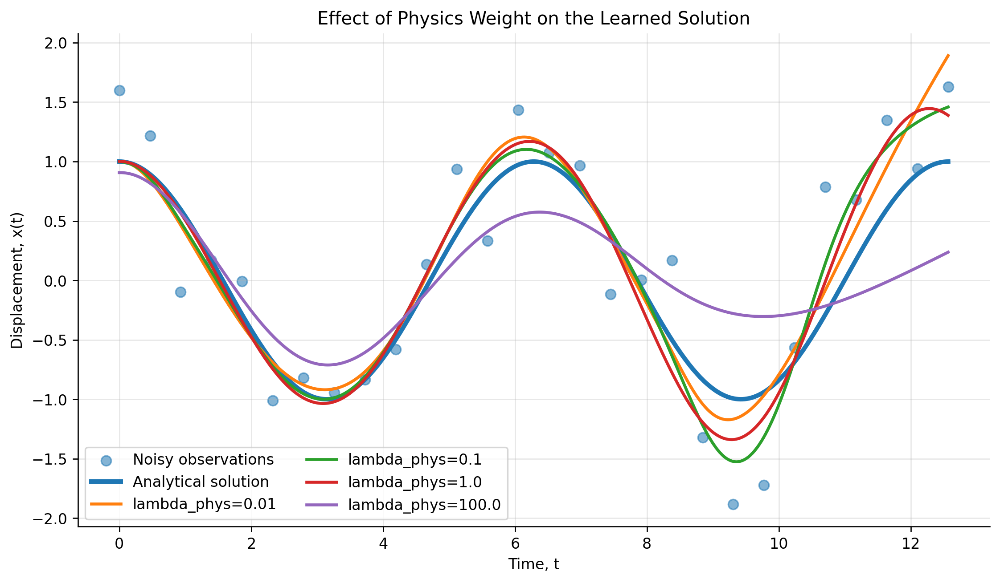
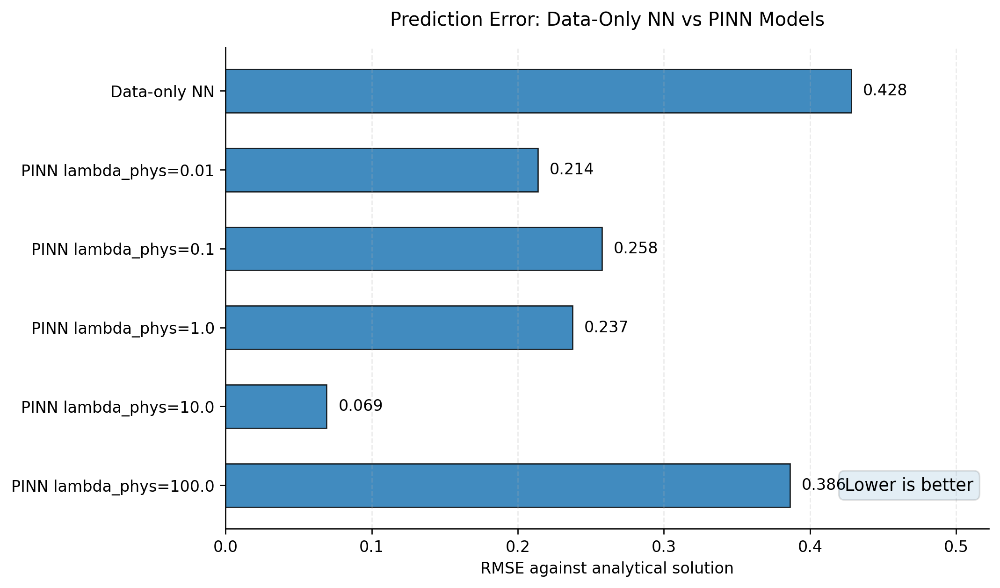
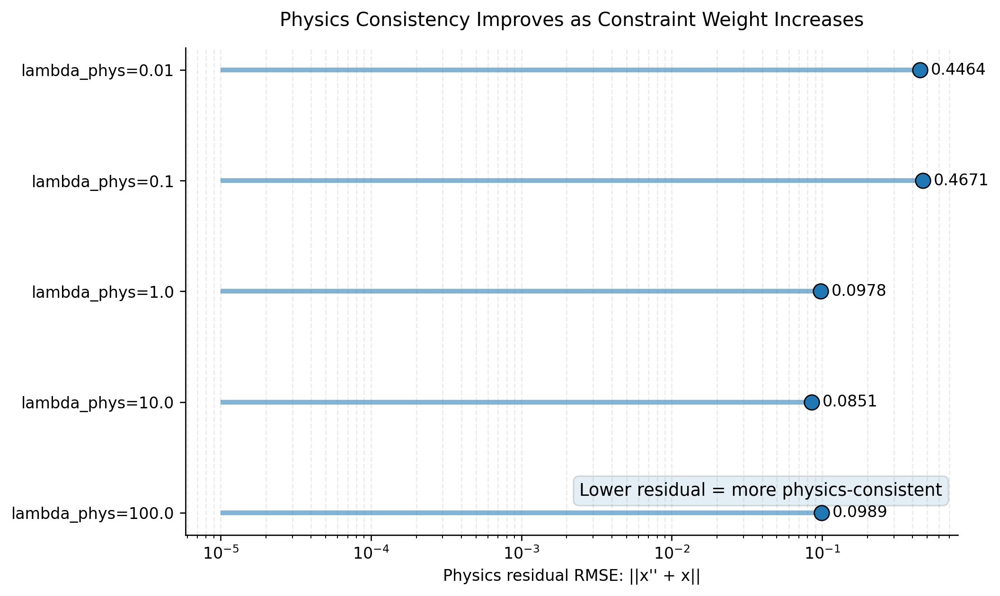

# Physics-Informed Least Squares for a Simple Harmonic Oscillator

This project demonstrates one of the central ideas behind modern Scientific Machine Learning (SciML): physical laws can improve learning when observational data is noisy or incomplete.

## The Physical System

We study the classical simple harmonic oscillator governed by

$$
\frac{d^2x}{dt^2}+x=0
$$

## Analytical Solution

Assume an exponential trial solution:

$$
x(t)=e^{rt}
$$

Then

$$
\frac{d^2x}{dt^2}=r^2e^{rt}
$$

Substituting into the oscillator equation gives

$$
r^2e^{rt}+e^{rt}=0
$$

Factoring out the exponential term gives

$$
e^{rt}(r^2+1)=0
$$

Since

$$
e^{rt}\neq 0
$$

the characteristic equation becomes

$$
r^2+1=0
$$

Therefore,

$$
r=\pm i
$$

Using Euler's identity,

$$
e^{it}=\cos(t)+i\sin(t)
$$

the real-valued general solution becomes

$$
x(t)=A\cos(t)+B\sin(t)
$$

Applying the initial conditions

$$
x(0)=1,\qquad x'(0)=0
$$

gives

$$
A=1,\qquad B=0
$$

Therefore the exact physical solution is

$$
x(t)=\cos(t)
$$

  

## Physics-Informed Least Squares

The physics loss is defined as

$$
\mathcal{L}_{phys}=\frac{1}{M}\sum_{j=1}^{M}\left(\frac{d^2x}{dt^2}(t_j)+x(t_j)\right)^2
$$

Equivalently,

$$
\mathcal{L}_{phys}=\int_{\Omega}\left(\frac{d^2x}{dt^2}+x\right)^2\,dt
$$

## Initial Condition Constraint

$$
\mathcal{L}_{IC}=\left(x(0)-1\right)^2+\left(x'(0)-0\right)^2
$$

## Full Optimization Objective

$$
\mathcal{L}=\lambda_{data}\mathcal{L}_{data}+\lambda_{phys}\mathcal{L}_{phys}+\lambda_{IC}\mathcal{L}_{IC}
$$

  

  

  

